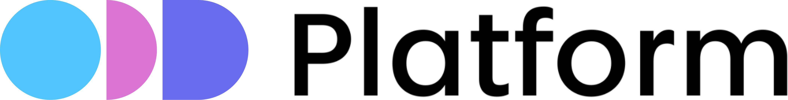

<div align="center">
&nbsp;
</div>

<h1 align="center" style="border-bottom: none">
    Next-Gen Data Discovery and Data Observability Platform <br>
</h1>

<div align="center">
    <a href="https://www.apache.org/licenses/LICENSE-2.0"></a>
    
    <a href="https://github.com/opendatadiscovery/odd-platform/graphs/contributors"></a>
    <a href="https://github.com/opendatadiscovery/odd-platform/contribute"></a>        
</div>

<p align="center">
    <a href="https://opendatadiscovery.org/"><b>Website</b></a> •
    <a href="https://www.linkedin.com/company/opendatadiscovery/"><b>LinkedIn</b></a> •
    <a href="https://go.opendatadiscovery.org/slack"><b>Slack</b></a> •
    <a href="https://docs.opendatadiscovery.org/"><b>Documentation</b></a> •
    <a href="https://blog.opendatadiscovery.org/"><b>Blog</b></a> •
    <a href="https://demo.oddp.io/"><b>Demo</b></a>
</p>

<p align="center"></p>

## Demo

Play with our [demo app](https://demo.oddp.io)!

## Introduction

ODD is an open-source data discovery and observability tool for data teams that helps to efficiently democratise data, power collaboration and reduce time on data discovery through modern user-friendly environment. 

### Key wins

* Shorten data discovery phase
* Have transparency on how and by whom the data is used
* Foster data culture by continuous compliance and data quality monitoring
* Accelerate data insights
* Know the sources of your dashboards and ad hoc reports
* Deprecate outdated objects responsibly by assessing and mitigating the risks


* :point_right: ODD Platform is a reference implementation of **[Open Data Discovery Spec](https://github.com/opendatadiscovery/opendatadiscovery-specification)**.

## Features

### Data Discovery and Observability

* Accumulate scattered data insights in Federated Data catalogue
* Gain observability through E2E Data objects Lineage
* Benefit from cutting-edge E2E microservices Lineage feature in tracking your data flow through the whole data landscape
* Be warned and alerted by Pipeline Monitoring tools
* Store your metadata 
* Use ODD-native modern lightweight UI


### ML First citizen

* Save results of your ML Experiments by automatically logging its parameters  


### Data Security & Compliance

* Manage Tags to prevent any abuse of the data
* Refer to Tags to stay compliant with data security standards
* Have full transparency on how and by whom the data is used


### Data Quality 

* Utilize advanced Data Quality Dashboard to gain insights into data quality metrics, trends, and issues across your datasets, enabling proactive data quality management
* Simplify DQ processes by using ODD with Great Expectations and DBT tests compatibility 
* Integrate ODD with any custom DQ framework

### Reference Data Management (Lookup Tables) - a part of Master Data Management (MDM)

* Manage and store reference data centrally, ensuring a single source of truth for key data elements like currency codes, country names, and product categories, etc.
* Easily integrate Lookup Tables with data pipelines and transformations, enhancing data enrichment and validation processes
* Support data governance and compliance efforts by maintaining accurate and consistent reference data across all data assets


## Getting Started 
### Running as a separate container

Setting up PostgreSQL connection details, for example:
```
export POSTGRES_HOST=172.17.0.1 \
export POSTGRES_PORT=5432 \
export POSTGRES_DATABASE=postgres \
export POSTGRES_USER=postgres \
export POSTGRES_PASSWORD=mysecretpassword
```
Starting new instance of the platform:
```
docker run -d \
  --name odd-platform \
  -e SPRING_DATASOURCE_URL=jdbc:postgresql://${POSTGRES_HOST}:${POSTGRES_PORT}/${POSTGRES_DATABASE} \
  -e SPRING_DATASOURCE_USERNAME=${POSTGRES_USER} \
  -e SPRING_DATASOURCE_PASSWORD=${POSTGRES_PASSWORD} \  
  -p 8080:8080 \
  ghcr.io/opendatadiscovery/odd-platform:latest
```
Go to [localhost:8080](http://localhost:8080) in case of local environment

### Running Locally with Docker Compose

```
docker-compose -f docker/demo.yaml up -d odd-platform-enricher
```

* :point_right: **[QUICKSTART](./docker/README.md)** 

### Deploying to Kubernetes with Helm Charts

* :point_right: **[QUICKSTART](https://github.com/opendatadiscovery/charts/blob/main/QUICKSTART.md)**

### Example configurations

There are various example configurations (via docker-compose) within **[docker/examples directory](https://github.com/opendatadiscovery/odd-platform/tree/main/docker/examples)**.

## Contributing

Contributing to ODD Platform is very welcome. For basic contributions, all you need is being comfortable with GitHub and Git. The best ways to contribute are: 
* Work on new adapters 
* Work on documentation

To ensure equal and positive communication, we adhere to our [Code of Conduct](./CODE_OF_CONDUCT.md). Before starting any interactions with this repository, please read it and make sure to follow. 

Please before contributing check out our [Contributing Guide](./CONTRIBUTING.md) and issues labeled "good first issue": 

[](https://github.com/opendatadiscovery/odd-platform/contribute)

<br>

## Integrations
OpenDataDiscovery Platform offers comprehensive data source support to meet your needs.

<table>
    <thead>
        <tr>
            <th colspan="3">Existing integrations</th>
        </tr>
    </thead>
    <tbody>
        <tr>
            <td><a href="https://github.com/opendatadiscovery/odd-collector#odd-adapter">Proxy Adapter</a></td>
            <td><a href="https://github.com/opendatadiscovery/odd-airflow-adapter">Airflow</a></td>
            <td><a href="https://github.com/opendatadiscovery/odd-airflow-2">Airflow 2+</a></td>
        </tr>
        <tr>
            <td><a href="https://github.com/opendatadiscovery/odd-collector#druid">Apache Druid</a></td>
            <td><a href="https://github.com/opendatadiscovery/odd-collector#cassandra">Cassandra</a></td>
            <td><a href="https://github.com/opendatadiscovery/odd-collector#clickhouse">Clickhouse</a></td>
        </tr>
        <tr>
            <td><a href="https://github.com/opendatadiscovery/odd-collector#elasticsearch">Elasticsearch </a></td>
            <td><a href="https://github.com/opendatadiscovery/odd-collector#hive">Hive</a></td>
            <td><a href="https://github.com/opendatadiscovery/odd-collector#kafka">Kafka</a></td>
        </tr>
        <tr>
            <td><a href="https://github.com/opendatadiscovery/odd-collector#feast">Feast </a></td>
            <td><a href="https://github.com/opendatadiscovery/odd-collector#mssql">MSSQL</a></td>
            <td><a href="https://github.com/opendatadiscovery/odd-collector#mysql">MySQL</a></td>
        </tr>
        <tr>
            <td><a href="https://github.com/opendatadiscovery/odd-collector#odbc">Microsoft ODBC</a></td>
            <td><a href="https://github.com/opendatadiscovery/odd-collector#mongodb">MongoDB </a></td>
            <td><a href="https://github.com/opendatadiscovery/odd-collector#neo4j">Neo4j </a></td>
        </tr>
        <tr>
            <td><a href="https://github.com/opendatadiscovery/odd-collector#mariadb">MariaDB</a></td>
            <td><a href="https://github.com/opendatadiscovery/odd-collector#oracle">Oracle</a></td>
            <td><a href="https://github.com/opendatadiscovery/odd-collector#postgresql">PostgreSQL</a></td>
        </tr>
        <tr>
            <td><a href="https://github.com/opendatadiscovery/odd-collector#redshift">Redshift</a></td>
            <td><a href="https://github.com/opendatadiscovery/odd-collector#snowflake">Snowflake</a></td>
            <td><a href="https://github.com/opendatadiscovery/odd-collector#vertica">Vertica</a></td>
        </tr>
        <tr>
            <td><a href="https://github.com/opendatadiscovery/odd-collector#tarantool">Tarantool</a></td>
            <td><a href="https://github.com/opendatadiscovery/odd-collector-aws#athena">Athena</a></td>
            <td><a href="https://github.com/opendatadiscovery/odd-collector-aws#dynamodb">DynamoDB</a></td>
        </tr>
        <tr>
            <td><a href="https://github.com/opendatadiscovery/odd-collector-aws#glue">Glue</a></td>
            <td><a href="https://github.com/opendatadiscovery/odd-collector-aws#kinesis">Kinesis</a></td>
            <td><a href="https://github.com/opendatadiscovery/odd-collector-aws#quicksight">Quicksight </a></td>
        </tr>
        <tr>
            <td><a href="https://github.com/opendatadiscovery/odd-collector-aws#s3">S3</a></td>
            <td><a href="https://github.com/opendatadiscovery/odd-collector-aws#sagemaker">SageMaker</a> </td>
            <td><a href="https://github.com/opendatadiscovery/odd-collector-aws#sagemaker-featurestore">SageMaker Featurestore</a></td>
        </tr>
        <tr>
            <td><a href="https://github.com/opendatadiscovery/odd-collector-aws#sqs">SQS</a></td>
            <td><a href="https://github.com/opendatadiscovery/odd-collector-aws#s3_delta">Delta lake S3</a></td>
            <td><a href="https://github.com/opendatadiscovery/odd-collector#tableau">Tableau </a></td>
        </tr>
        <tr>
            <td><a href="https://github.com/opendatadiscovery/odd-collector#cubejs">Cube</a></td>
            <td><a href="https://github.com/opendatadiscovery/odd-collector#superset">SuperSet</a></td>
            <td><a href="https://github.com/opendatadiscovery/odd-collector-azure#powerbi">PowerBi</a>
        </tr>
        <tr>
            <td><a href="https://github.com/opendatadiscovery/odd-collector#trino">Trino</a></td>
            <td><a href="https://github.com/opendatadiscovery/odd-collector#presto">Presto</a></td>
            <td><a href="https://github.com/opendatadiscovery/odd-collector#dbt">DBT</a></td>
        </tr>
        <tr>
            <td><a href="https://github.com/opendatadiscovery/odd-collector#redash">Redash</a></td>
            <td><a href="https://github.com/opendatadiscovery/odd-spark-adapter">Spark</a></td>
            <td><a href="https://github.com/opendatadiscovery/odd-collector#mlflow">MLflow</a></td>
        </tr>
        <tr>
            <td><a href="https://github.com/opendatadiscovery/odd-collector#kubeflow">Kubeflow</a></td>
            <td><a href="https://github.com/opendatadiscovery/odd-collector#databricks">Databricks Unity Catalog</a></td>
            <td><a href="https://github.com/opendatadiscovery/odd-great-expectations">Great Expectations</a></td>
        </tr>
        <tr>
            <td><a href="https://github.com/opendatadiscovery/odd-collector#sqlite">SQLite</a></td>
            <td><a href="https://github.com/opendatadiscovery/odd-collector#couchbase">Couchbase</a></td>
            <td><a href="https://github.com/opendatadiscovery/odd-collector#cockroachdb">Cockroachdb</a></td>
        </tr>
        <tr>
            <td><a href="https://github.com/opendatadiscovery/odd-collector#fivetran">Fivetran</a></td>
            <td><a href="https://github.com/opendatadiscovery/odd-collector#airbyte">Airbyte</a></td>
            <td><a href="https://github.com/opendatadiscovery/odd-collector#metabase">Metabase</a></td>
        </tr>
        <tr>
            <td><a href="https://github.com/opendatadiscovery/odd-collector#mode">Mode</a></td>
            <td><a href="https://github.com/opendatadiscovery/odd-collector-gcp#biquery">BigQuery</a></td>
            <td><a href="https://github.com/opendatadiscovery/odd-collector#singlestore">Singlestore</a></td>
        </tr>
    </tbody>
</table>

## ODD Data Model

ODD operates the following high-level types of entities:

<ol>
<li><b>Datasets </b>(collections of data: tables, topics, files, feature groups)</li>
<li><b>Transformers </b>(transformers of data: ETL or ML training jobs, experiments)</li> 
<li><b>Data Consumers </b>(data consumers: ML models or BI dashboards)</li> 
<li><b>Data Quality Tests </b>(data quality tests for datasets)</li> 
<li><b>Data Inputs </b>(sources of data)</li>
<li><b>Transformer Runs </b>(executions of ETL or ML training jobs)</li>
<li><b>Quality Test Runs </b>executions of data quality tests</li> 
</ol>

For more information, please check **[specification.md](https://github.com/opendatadiscovery/opendatadiscovery-specification/blob/main/specification/specification.md)**.


## Community Support

Join our community if you need help, want to chat or have any other questions for us:

- [GitHub](https://github.com/opendatadiscovery/odd-platform/discussions) - Discussion forums and issues
- [Slack](https://go.opendatadiscovery.org/slack) - Join the conversation! Get all the latest updates and chat to the devs


## Contacts

If you have any questions or ideas, please don't hesitate to drop a line to any of us. 


| Team Member      | LinkedIn                                                           | GitHub                                              |
| ---------------- | ------------------------------------------------------------------ | --------------------------------------------------- |
| German Osin      | [LinkedIn](https://www.linkedin.com/in/german-osin-47a9339/)       | [germanosin](https://github.com/germanosin)         |
| Nikita Dementev  | [LinkedIn](https://www.linkedin.com/in/nikita-dementev/)           | [DementevNikita](https://github.com/DementevNikita) |
| Damir Abdullin   | [LinkedIn](https://www.linkedin.com/in/dabdullin/)                 | [damirabdul](https://github.com/damirabdul)         |
| Alexey Kozyurov  | [LinkedIn](https://www.linkedin.com/in/aleksei-koziurov/)          | [Leshe4ka](https://github.com/Leshe4ka)             |
| Pavel Makarichev | [LinkedIn](https://www.linkedin.com/in/pavel-makarichev-8a8730a4/) | [vixtir](https://github.com/vixtir)                 |
| Roman Zabaluev   | [LinkedIn](https://www.linkedin.com/in/haarolean/)                 | [Haarolean](https://github.com/haarolean)           |
## License

ODD Platform uses the [Apache 2.0 License](https://www.apache.org/licenses/LICENSE-2.0.txt).
