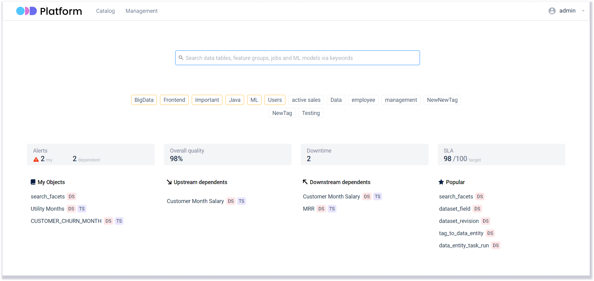

<p>
&nbsp;
</p>

<br>

[](https://www.apache.org/licenses/LICENSE-2.0)
[]()
[](https://github.com/opendatadiscovery/odd-platform/graphs/contributors)
[](https://join.slack.com/t/opendatadiscovery/shared_invite/zt-tgdhil90-1kcAuGBo9psX3CJbSsUJ4g)
[](https://github.com/opendatadiscovery/odd-platform/contribute)

<br>

# Open Data Discovery Platform: Next-Gen Data Observability and Reliability 

<p align="center">
&nbsp;
</p>

<br>

## Overview

We’re building a next-generation data discovery and observability tool for enterprises that helps to efficiently democratize data, powers collaboration of data science and data engineering teams, significantly reduces time to data discovery, cuts on data downtime and offers modern, easy-to-use environment with quick time-to-value. ODD makes all your data entities reliable, observable, and easily discoverable.  

* :point_right: ODD Platform is a reference implementation of **[Open Data Discovery Spec](https://github.com/opendatadiscovery/opendatadiscovery-specification)**.


<br>

## Features

### Architecture

* Powered by a universal open standard for metadata collection
* Much faster and of better quality of data discovery  
* Democratizes data across an organization, making it self-service
* Allows building meta catalogs by federating any data catalogs you’re using 
* Composable and pluggable architecture that can fit any data strategy/business 
* Easily integrates with other open standards, data catalogs, tools an ML ecosystem
* Wide variety of data sources (BI, ML, ETL, ELT, data quality tools, warehouses, etc.)
* A multi-cloud solution not tying you to any particular cloud
* Quick and easy deployment without having to provide complex infrastructure
* Fully open-source and community-based - no closed / proprietary agenda  

### Data Discovery 

* Trust your data with truly end-to-end, context-rich data discovery 
* Enrich entities with custom metadata, descriptions, owners and tags  
* Rich context, schemas and lineage for all data entities
* Rich data profiling: overall statistics, labels, descriptions, uniqueness, etc. 
* Discoverable ML entities - ML pipelines, experiments, feature stores are 1st citizens 
* Modern lightweight UI and management of your data sources, owners, tags. 

### Data Observability 

* Truly end-to-end data lineage across all the tools used in the company
* Alerts for changes and issues informing you what/who’s entities were affected
* Empowers collaboration between Data Science and Data Engineering teams  

### Data Quality 

* Lets you enrich any data with data quality tests  
* Easily integrates with any data quality tools

### Data Security & Governance 

* Doesn’t touch actual data for security reasons: operates metadata only  
* Know what data is PII: label PII and other special data at the column level 


## Getting Started 

### Running Locally with Docker Compose

**```docker-compose -f docker/demo.yaml up -d```** 

* :point_right: **[QUICKSTART](./docker/README.md)** 

### Deploying to Kubernetes with Helm Charts

TBA 

<br>

## Contributing

Contributing to ODD Platform is very welcome. For basic contributions, all you need is being comfortable with GitHub and Git. The best ways to contribute are: 
* Work on new adapters 
* Work on documentation

To ensure equal and positive communication, we adhere to our [Code of Conduct](./CODE_OF_CONDUCT.md). Before starting any interactions with this repository, please read it and make sure to follow. 

Please before contributing check out our [Contributing Guide](./CONTRIBUTING.md) and issues labeled "good first issue": 

[](https://github.com/opendatadiscovery/odd-platform/contribute)

<br>

## Integrations


ODD Platform works with many of the tools you're already using and is actively developing new integrations. 

Exisiting integrations: 
<table>
	<thead>
		<tr>
			<th colspan="2">Integration</th>
			<th>Entities ODD Gathers Metadata From</th>
		</tr>
	</thead>
	<tbody>
		<tr><td style="text-align: center; height=40px;">                                    </td><td style="width: 200px;"><a href="https://github.com/opendatadiscovery/odd-clickhouse-adapter">Clickhouse</a>                  </td><td>Datasets, Transformers</td></tr>
				<tr><td style="text-align: center; height=40px;">            </td><td style="width: 200px;"><a href="https://github.com/opendatadiscovery/odd-airflow-adapter">Airflow</a></td><td>Transformers, Transformer Runs</td></tr>
		<tr><td style="text-align: center; height=40px;">                             </td><td style="width: 200px;"><a href="https://github.com/opendatadiscovery/odd-odbc-adapter">Microsoft ODBC </a>                   </td><td>Datasets, Transformers</td></tr>
		<tr><td style="text-align: center; height=40px;">                             </td><td style="width: 200px;"><a href="https://github.com/opendatadiscovery/odd-glue-adapter">AWS Glue</a></td><td>Datasets, Transformers, Transformer Runs</td></tr>
		<tr><td style="text-align: center; height=40px;">          </td><td style="width: 200px;"><a href="https://github.com/opendatadiscovery/odd-mysql-adapter">MySQL</a></td><td>Datasets, Transformers</td></tr>
		<tr><td style="text-align: center; height=40px;"></td><td style="width: 200px;"><a href="https://github.com/opendatadiscovery/odd-dbt-adapter">DBT </a></td><td>Datasets, Transformers, Transformer Runs</td></tr>
		<tr><td style="text-align: center; height=40px;"></td><td style="width: 200px;"><a href="https://github.com/opendatadiscovery/odd-dynamodb-adapter">DynamoDB </a></td><td>Datasets</td></tr>
		<tr><td style="text-align: center; height=40px;">                       </td><td style="width: 200px;"><a href="https://github.com/opendatadiscovery/odd-tableau-adapter">Tableau </a></td><td>Datasets, Consumers</td></tr>
		<tr><td style="text-align: center; height=40px;">                 </td><td style="width: 200px;"><a href="https://github.com/opendatadiscovery/odd-kafka-adapter">Kafka</a></td><td>Datasets</td></tr>
		<tr><td style="text-align: center; height=40px;"> </td><td style="width: 200px;"><a href="https://github.com/opendatadiscovery/odd-snowflake-adapter">Snowflake</a></td><td>Datasets, Transformers</td></tr>
		<tr><td style="text-align: center; height=40px;"></td><td style="width: 200px;"><a href="https://github.com/opendatadiscovery/odd-redshift-adapter">Redshift</a></td><td>Datasets, Transformers</td></tr>
		<tr><td style="text-align: center; height=40px;">                                         </td><td style="width: 200px;"><a href="https://github.com/opendatadiscovery/odd-postgresql-adapter">PostgreSQL</a></td><td>Datasets, Transformers</td></tr>
		<tr><td style="text-align: center; height=40px;">            </td><td style="width: 200px;"><a href="https://github.com/opendatadiscovery/odd-mssql-adapter">MSSQL</a></td><td>Datasets, Transformers</td></tr>
</table>

<br>
Coming soon: 

<table>
	<thead>
		<tr>
			<th colspan="2">Integration</th>
			<th>Entities ODD Gathers Metadata From</th>
		</tr>
	</thead>
	<tbody>
		<tr><td style="text-align: center; height=40px;">                                             </td><td style="width: 200px;">Apache Hive        </td><td>Datasets</td></tr>
		<tr><td style="text-align: center; height=40px;">            </td><td style="width: 200px;">Kubeflow                   </td><td>Transformers, Transformer Runs</td></tr>
		<tr><td style="text-align: center; height=40px;">            </td><td style="width: 200px;">SageMaker                   </td><td>Datasets</td></tr>
		<tr><td style="text-align: center; height=40px;">            </td><td style="width: 200px;">Oracle                   </td><td>Datasets, Transformers</td></tr>
		<tr><td style="text-align: center; height=40px;">            </td><td style="width: 200px;">DVC                </td><td>Transformers, Transformer Runs</td></tr>
		<tr><td style="text-align: center; height=40px;">            </td><td style="width: 200px;">Spark               </td><td>Transformers, Transformer Runs</td></tr>
		<tr><td style="text-align: center; height=40px;">            </td><td style="width: 200px;">Great Expectations               </td><td>Transformers, Transformer Runs</td></tr>
	</tbody>
</table>

<br>

## ODD Data Model

ODD operates the following high-level types of entities:

<ol>
<li><b>Datasets</b>(collections of data: tables, topics, files, feature groups)</li>
<li><b>Transformers</b>(transformers of data: ETL or ML training jobs, experiments)</li> 
<li><b>Data Consumers</b>(data consumers: ML models or BI dashboards)</li> 
<li><b>Data Quality Tests</b>(data quality tests for datasets)</li> 
<li><b>Data Inputs</b>(sources of data)</li>
<li><b>Transformer Runs</b>(executions of ETL or ML training jobs)</li>
<li><b>Quality Test Runs</b>executions of data quality tests</li> 
</ol>

For more information, please check **[specification.md](https://github.com/opendatadiscovery/opendatadiscovery-specification/blob/main/specification/specification.md)**.

## License

ODD Platform uses the [Apache 2.0 License](https://www.apache.org/licenses/LICENSE-2.0.txt).
