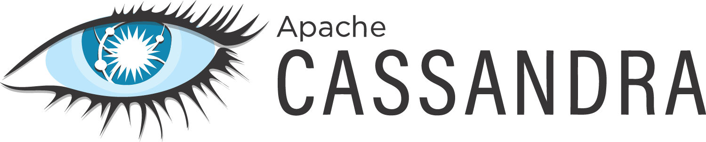
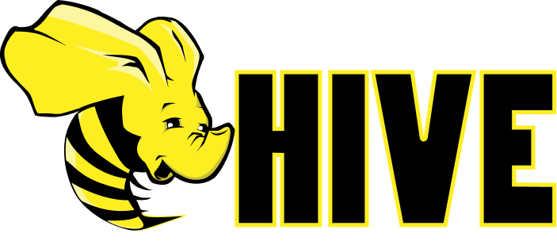
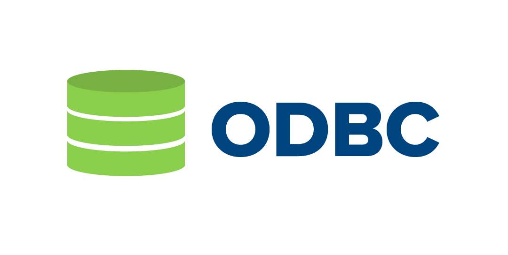
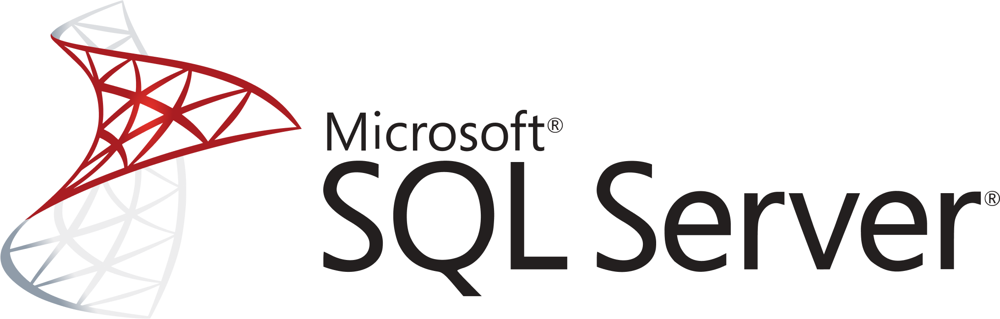
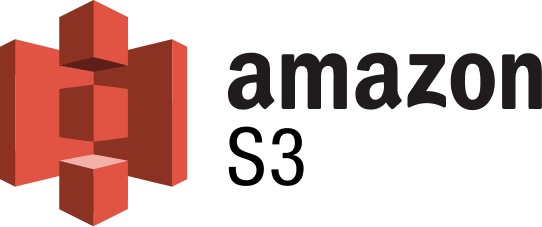
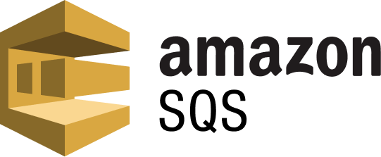

<p> 
&nbsp;
</p>

<br>

[](https://www.apache.org/licenses/LICENSE-2.0)
[]()
[](https://github.com/opendatadiscovery/odd-platform/graphs/contributors)
[](https://go.opendatadiscovery.org/slack)
[](https://github.com/opendatadiscovery/odd-platform/contribute)

<br>

# Open Data Discovery Platform: Next-Gen Data Discovery and Observability 

#new comment


## Introduction

ODD is an open-source data discovery and observability tool for data teams that helps to efficiently democratise data, power collaboration and reduce time on data discovery through modern user-friendly environment. 

### Key wins

* Shorten data discovery phase
* Have transparency on how and by whom the data is used
* Foster data culture by continuous compliance and data quality monitoring
* Accelerate data insights
* Know the sources of your dashboards and ad hoc reports
* Deprecate outdated objects responsibly by assessing and mitigating the risks


* :point_right: ODD Platform is a reference implementation of **[Open Data Discovery Spec](https://github.com/opendatadiscovery/opendatadiscovery-specification)**.

## Features

### Data Discovery and Observability

* Accumulate scattered data insights in Federated Data catalogue
* Gain observability through E2E Data objects Lineage
* Benefit from cutting-edge E2E microservices Lineage feature in tracking your data flow through the whole data landscape
* Be warned and alerted by Pipeline Monitoring tools
* Store your metadata 
* Use ODD-native modern lightweight UI


### ML First citizen

* Save results of your ML Experiments by automatically logging its parameters  


### Data Security & Compliance

* Manage Tags and Labels to prevent any abuse of the data
* Refer to Tags and Labels to stay compliant with data security standards
* Have full transparency on how and by whom the data is used


### Data Quality 

* Simplify DQ processes by using ODD and Great Expectations compatibility 
* Integrate ODD with any custom DQ framework


## Getting Started 

### Running Locally with Docker Compose

**```docker-compose -f docker/demo.yaml up -d odd-platform-enricher```** 

* :point_right: **[QUICKSTART](./docker/README.md)** 

### Deploying to Kubernetes with Helm Charts

* :point_right: **[QUICKSTART](https://github.com/opendatadiscovery/charts/blob/master/QUICKSTART.md)**

### Example configurations

There are various example configurations (via docker-compose) within **[docker/examples directory](https://github.com/opendatadiscovery/odd-platform/tree/main/docker/examples)**.

## Contributing

Contributing to ODD Platform is very welcome. For basic contributions, all you need is being comfortable with GitHub and Git. The best ways to contribute are: 
* Work on new adapters 
* Work on documentation

To ensure equal and positive communication, we adhere to our [Code of Conduct](./CODE_OF_CONDUCT.md). Before starting any interactions with this repository, please read it and make sure to follow. 

Please before contributing check out our [Contributing Guide](./CONTRIBUTING.md) and issues labeled "good first issue": 

[](https://github.com/opendatadiscovery/odd-platform/contribute)

<br>

## Integrations
ODD Platform works with many of the tools you're already using: 

<table>
	<thead>
		<tr>
			<th colspan="2">Existing integrations</th>
		</tr>
	</thead>
	<tbody>
	<tr><td style="text-align: center; height=40px;">            </td><td style="width: 200px;"><a href="https://github.com/opendatadiscovery/odd-airflow-adapter">Airflow</a></td>
	<tr><td style="text-align: center; height=40px;">                                             </td><td style="width: 200px;"><a href="https://github.com/opendatadiscovery/odd-collector-aws#athena">Athena</a>        </td>
	<tr><td style="text-align: center; height=40px;">                                             </td><td style="width: 200px;"><a href="https://github.com/opendatadiscovery/odd-collector#cassandra">Cassandra</a>        </td>
	<tr><td style="text-align: center; height=40px;">                   </td><td style="width: 200px;"><a href="https://github.com/opendatadiscovery/odd-collector#clickhouse">Clickhouse</a></td>
	<tr><td style="text-align: center; height=40px;">                       </td><td style="width: 200px;"><a href="https://github.com/opendatadiscovery/odd-collector#dbt">DBT</a>
	<tr><td style="text-align: center; height=40px;"></td><td style="width: 200px;"><a href="https://github.com/opendatadiscovery/odd-collector-aws#dynamodb">DynamoDB </a></td>
	<tr><td style="text-align: center; height=40px;"></td><td style="width: 200px;"><a href="https://github.com/opendatadiscovery/odd-collector#elasticsearch">Elasticsearch </a></td>
	<tr><td style="text-align: center; height=40px;"></td><td style="width: 200px;"><a href="https://github.com/opendatadiscovery/odd-collector#feast">Feast </a></td>
	<tr><td style="text-align: center; height=40px;">                             </td><td style="width: 200px;"><a href="https://github.com/opendatadiscovery/odd-collector-aws#glue">Glue</a></td>
	<tr><td style="text-align: center; height=40px;">                                            </td><td style="width: 200px;"><a href="https://github.com/opendatadiscovery/odd-collector#hive">Hive        </td>
	<tr><td style="text-align: center; height=40px;">                 </td><td style="width: 200px;"><a href="https://github.com/opendatadiscovery/odd-kafka-adapter">Kafka</a></td>
	<tr><td style="text-align: center; height=40px;"></td><td style="width: 200px;"><a href="https://github.com/opendatadiscovery/odd-collector-aws#kinesis">Kinesis </a></td>
	<tr><td style="text-align: center; height=40px;">            </td><td style="width: 200px;"><a href="https://github.com/opendatadiscovery/odd-collector#kubeflow">Kubeflow </a>                   </td>
	<tr><td style="text-align: center; height=40px;"></td><td style="width: 200px;"><a href="https://github.com/opendatadiscovery/odd-odbc-adapter">Microsoft ODBC</a></td>
	<tr><td style="text-align: center; height=40px;"></td><td style="width: 200px;"><a href="https://github.com/opendatadiscovery/odd-collector#mongodb">MongoDB </a></td>
	<tr><td style="text-align: center; height=40px;">            </td><td style="width: 200px;"><a href="https://github.com/opendatadiscovery/odd-mssql-adapter">MSSQL</a></td>
    <tr><td style="text-align: center; height=40px;">          </td><td style="width: 200px;"><a href="https://github.com/opendatadiscovery/odd-collector#mysql">MySQL</a></td>
    <tr><td style="text-align: center; height=40px;"></td><td style="width: 200px;"><a href="https://github.com/opendatadiscovery/odd-collector#neo4j">Neo4j </a></td>
    <tr><td style="text-align: center; height=40px;">                    </td><td style="width: 200px;"><a href="https://github.com/opendatadiscovery/odd-collector#postgresql">PostgreSQL</a></td>
    <tr><td style="text-align: center; height=40px;"></td><td style="width: 200px;"><a href="https://github.com/opendatadiscovery/odd-collector-aws#quicksight">Quicksight </a></td>
    <tr><td style="text-align: center; height=40px;"></td><td style="width: 200px;"><a href="https://github.com/opendatadiscovery/odd-collector#redshift">Redshift</a></td>
    <tr><td style="text-align: center; height=40px;"></td><td style="width: 200px;"><a href="https://github.com/opendatadiscovery/odd-collector-aws#s3">S3 </a></td>
    <tr><td style="text-align: center; height=40px;">            </td><td style="width: 200px;"><a href="https://github.com/opendatadiscovery/odd-collector-aws#sagemaker">SageMaker</a>                   </td>
    <tr><td style="text-align: center; height=40px;"></td><td style="width: 200px;"><a href="https://github.com/opendatadiscovery/odd-collector-aws#sagemaker-featurestore">SageMaker Featurestore </a></td>
    <tr><td style="text-align: center; height=40px;"> </td><td style="width: 200px;"><a href="https://github.com/opendatadiscovery/odd-collector#snowflake">Snowflake</a></td>
    <tr><td style="text-align: center; height=40px;">                                            </td><td style="width: 200px;"><a href="https://github.com/opendatadiscovery/odd-spark-adapter">Spark        </td>
    <tr><td style="text-align: center; height=40px;"></td><td style="width: 200px;"><a href="https://github.com/opendatadiscovery/odd-collector-aws#sqs">SQS </a></td>
    <tr><td style="text-align: center; height=40px;">                       </td><td style="width: 200px;"><a href="https://github.com/opendatadiscovery/odd-collector#tableau">Tableau </a></td>
    <tr><td style="text-align: center; height=40px;">            </td><td style="width: 200px;"><a href="https://github.com/opendatadiscovery/odd-collector#tarantool">Tarantool</a>                   </td>
    </tbody>
</table>

## ODD Data Model

ODD operates the following high-level types of entities:

<ol>
<li><b>Datasets </b>(collections of data: tables, topics, files, feature groups)</li>
<li><b>Transformers </b>(transformers of data: ETL or ML training jobs, experiments)</li> 
<li><b>Data Consumers </b>(data consumers: ML models or BI dashboards)</li> 
<li><b>Data Quality Tests </b>(data quality tests for datasets)</li> 
<li><b>Data Inputs </b>(sources of data)</li>
<li><b>Transformer Runs </b>(executions of ETL or ML training jobs)</li>
<li><b>Quality Test Runs </b>executions of data quality tests</li> 
</ol>

For more information, please check **[specification.md](https://github.com/opendatadiscovery/opendatadiscovery-specification/blob/main/specification/specification.md)**.

## Contacts

If you have any questions or ideas, please don't hesitate to drop a line to any of us. 


| Team Member               | LinkedIn                                      	                              | GitHub                                              |
|---------------------------|------------------------------------------------------------------------------|-----------------------------------------------------|
| German Osin               | [LinkedIn](https://www.linkedin.com/in/german-osin-47a9339/)      	          | [germanosin](https://github.com/germanosin)         |
| Nikita Dementev           | [LinkedIn](https://www.linkedin.com/in/nikita-dementev/)                     | [DementevNikita](https://github.com/DementevNikita) |
| Damir Abdullin            | [LinkedIn](https://www.linkedin.com/in/dabdullin/)                           | [damirabdul](https://github.com/damirabdul)         |
| Alexey Kozyurov           | [LinkedIn](https://www.linkedin.com/in/alexey-kozyurov-1823b1219/)           | [Leshe4ka](https://github.com/Leshe4ka)             |
| Pavel Makarichev          | [LinkedIn](https://www.linkedin.com/in/pavel-makarichev-8a8730a4/)           | [vixtir](https://github.com/vixtir)                 |
| Anna Evdokimova-Glinskaia | [LinkedIn](https://www.linkedin.com/in/anna-evdokimova-glinskaya-6566b5188/) | [Anna-EG](https://github.com/Anna-EG)               |
| Roman Zabaluev            | [LinkedIn](https://www.linkedin.com/in/haarolean/)                           | [Haarolean](https://github.com/haarolean)           |
## License

ODD Platform uses the [Apache 2.0 License](https://www.apache.org/licenses/LICENSE-2.0.txt).
