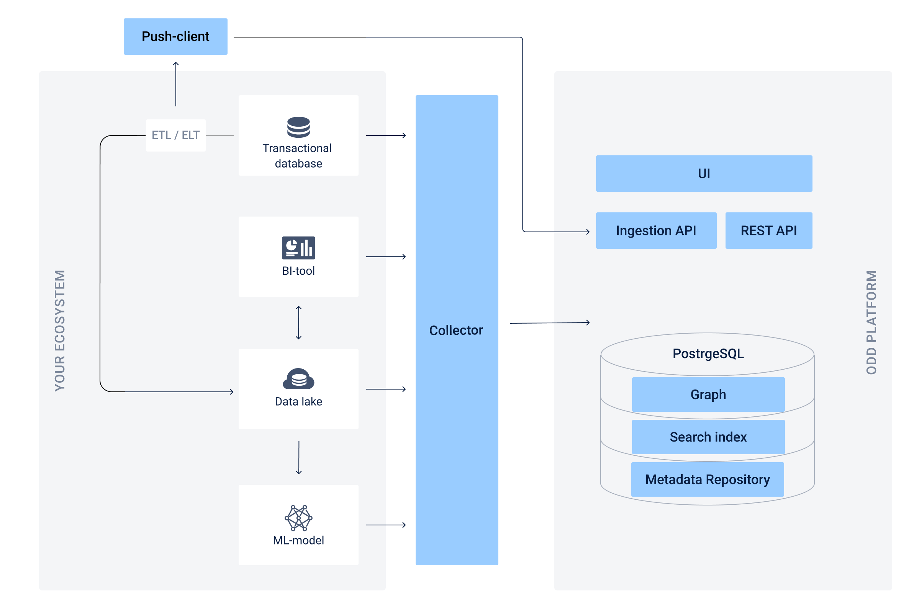

# Architecture

The diagram below contains the structure of the Platform and shows principles of data exchange between ODD and your in-house components.

A **Push-client** is a provider which sends information directly to the central repository of the Platform. Also [read](Adapters.md#push-and-pull-strategies) about a push-strategy.
## Collector
> :exclamation: The Collector is an upgraded version of a metadata gathering service. [Adapters](Adapters.md#adapters) will be deprecated soon!  

ODD Collector is a lightweight service which gathers metadata from all your data sources: 
* It manages your metadata according to the [Specification](https://github.com/opendatadiscovery/opendatadiscovery-specification/blob/main/specification/specification.md).
* It connects to all your data sources simultaneously and provides configurable scheduling.

### Collector types 
#### [AWS Collector](https://github.com/opendatadiscovery/odd-collector-aws)
* Athena
* DynamoDB
* Glue
* Kinesis
* Quicksight
* S3
* Sagemaker
* Sagemaker Featurestore
* SQS

[Config examples →](https://github.com/opendatadiscovery/odd-collector-aws/tree/main/config_examples)

#### [Collector](https://github.com/opendatadiscovery/odd-collector)
* Cassandra
* ClickHouse
* Dbt
* Elasticsearch
* Feast
* Hive
* Kubeflow
* MongoDB
* MySQL
* Neo4j
* PostgreSQL
* Redshift
* Snowflake
* Tableau
* Tarantool

[Config examples →](https://github.com/opendatadiscovery/odd-collector/tree/main/config_examples)
<!---
## Collector vs Adapters
A previous version of Platform architecture was based on adapters. This approach required to connect new adapter to each data source. Now you can install one Collector and ingest data from all your sources.
### Deprecated Adapters
> :exclamation: To use all features and recent updates of the Platform, we recommend you to install the Collector.

Here is a list of deprecated adapters:
* Glue
* DynamoDB
* S3
* PostgreSQL
* MySQL
* Redshift
* ClickHouse
* Quicksight
