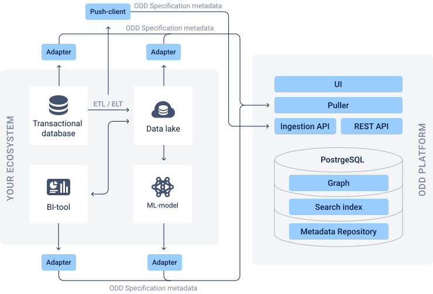

# Architecture
[Adapters](#adapters) \
[Push-client](#push-client) \
[ODD Specification metadata](#odd-specification-metadata) \
[Push and pull strategies](#push-and-pull-strategies) \
\
The diagram below contains the structure of the Platform and shows principles of data exchange between ODD and your in-house components.
\
 
 
### Adapters

Adapters are lightweight services that gather metadata in a standardized format. They are designed to be source-specific and expose only the information that could be gathered from a particular data source.

### Push-client

Push-clients are providers that send information to the central repository via APIs.\
\
_\ why do we offer it especially for ETL\ELT?_ _need more info here_\\

### ODD Specification metadata

## Push and pull strategies

The metadata discovery process is very similar to that of gathering metrics,logs and traces. It can be done through a pull or push model (or both). Each of the models has a range of use cases it suits best. ODD uses both models to effectively cover all core use cases.

### Pull strategy

Pulling metadata directly from the source is the most straightforward way of gathering it. However, an attempt to develop and maintain a centralized fleet of domain-specific crawlers can easily become a problem.\
Pulling data from multiple sources without having a standard compels to use multiple source-specific crawlers for each adapter, which is a complex and ineffective solution. ODD solves this issue by providing a universal adapter.\
Pull model is preferred when:    _|need more details_

* latency on index update is ok
* there is already an adapter

### Push strategy

Push model supports the process where individual metadata providers push the information to the central repository via APIs. The model is more preferred for use cases like Airflow job runs and quality check runs.            _|need more details_
