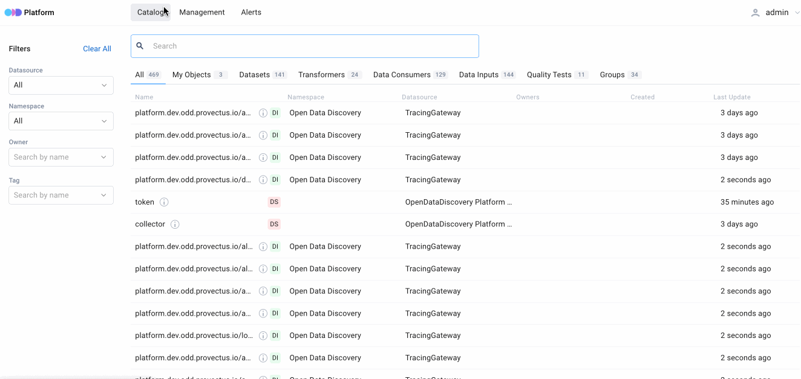
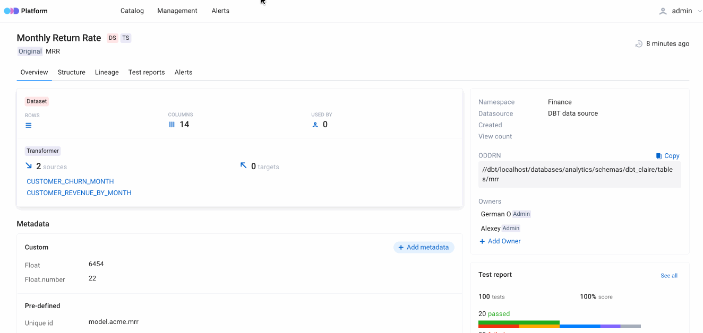
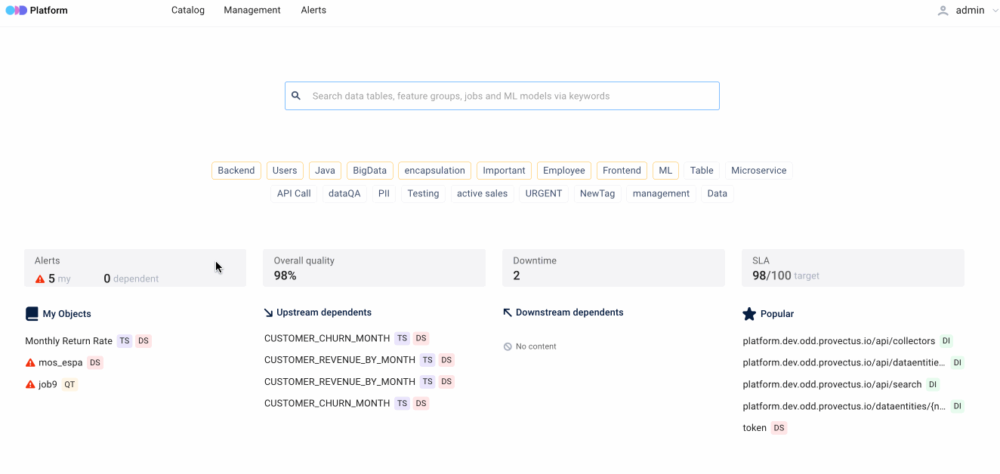
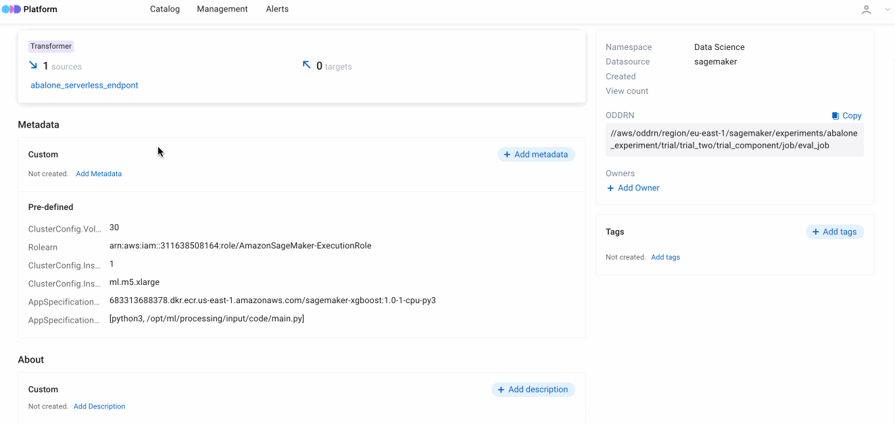
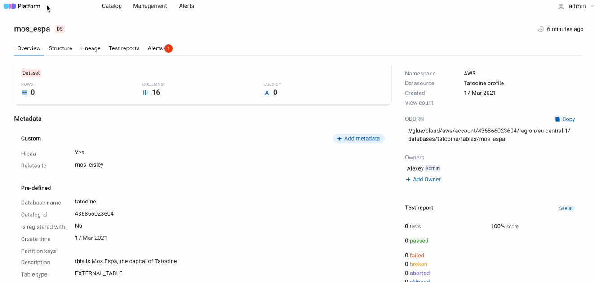
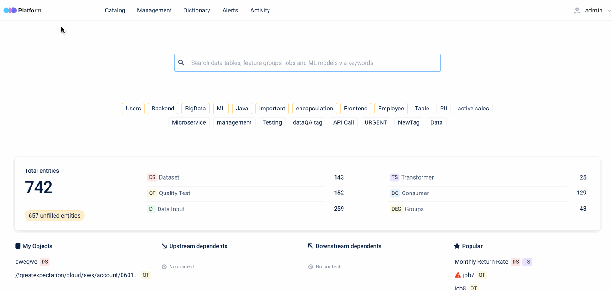
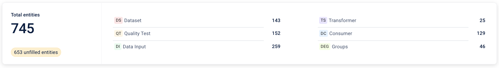
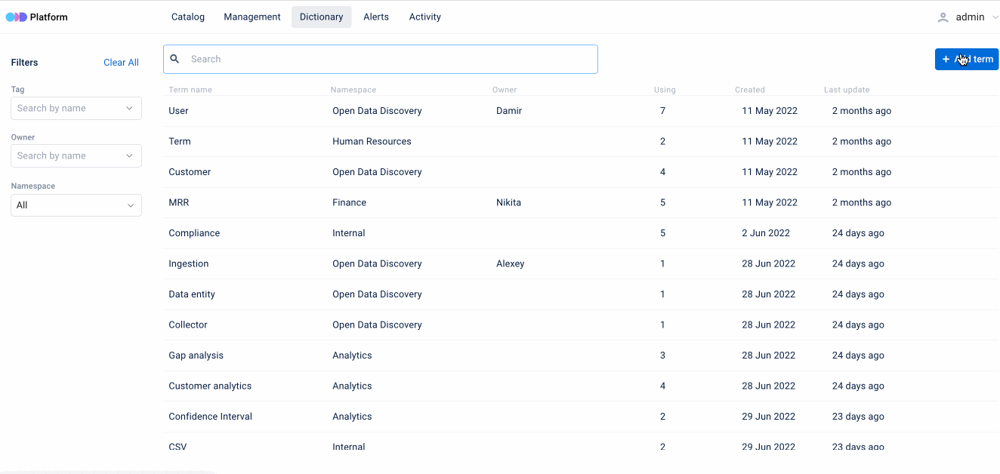
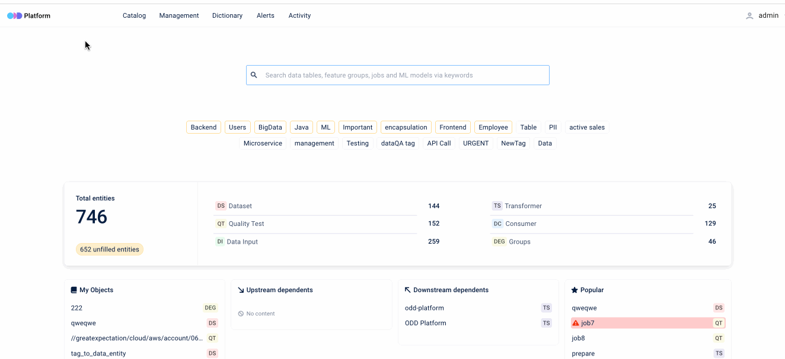

# Features
[Metadata Storage](#metadata-storage) \
[End-to-end Data Objects Lineage](#end-to-end-data-objects-lineage) \
[End-to-end Microservices Lineage](#end-to-end-microservices-lineage) \
[Data Quality Test Results Import](#data-quality-test-results-import) \
[Pipeline Monitoring and Alerting](#pipeline-monitoring-and-alerting) \
[ML Experiment Logging](#ml-experiment-logging) \
[Manual Object Tagging](#manual-object-tagging) \
[Data Entity Groups](#data-entity-groups) \
[Data Entity Report](#data-entity-report) \
[Customized Dictionary](#customized-dictionary) \
[Change History](#change-history) \
[Dataset Quality Statuses (SLA)](#dataset-quality-statuses-(sla)) 

## Metadata Storage 
The Storage is a data catalog which gathers metadata from your sources. Data processing is based on the near real-time approach.  A storage space is not limited. \
**ODD & PostgreSQL** provide saving metadata, lineage graphs and full text search, so extra integrations (Elasticsearch, Solr, Neo4j etc.) are not required.   
### Advanced search 
In your Platform account you may find any metadata element using the following options:
* Full-text search 
* Filtering by datasources, owners and tags

## End-to-end Data Objects Lineage
The Platform supports a lineage diagram, so you can easily track movement and change of your data entities. \
ODD supports the following **data objects**: 
* Datasets
* Data providers (third-party integrations)
* ETL and ML training jobs
* ML model artifacts and BI dashboards

[Read more](https://github.com/opendatadiscovery/opendatadiscovery-specification/blob/main/specification/specification.md#data-model-specification) about how these entities are used in the **ODD Data Model**.

## End-to-end Microservices Lineage 
This feature helps trace data provenance of your microservice-based app. ODD represents microservices as objects and shows their lineage as a typical diagram. \
The picture below shows the process of metadata ingestion.

## Data Quality Test Results Import
Monitor test suite results in the Platform and at the same don't think about masking or removing sensitive data. Your datasets don't migrate to your ODD Platform installation, it gathers test results only. \
The Platform is compatible with **Pandas** and **Great expectations**.

## Pipeline Monitoring and Alerting 
Running your pipelines are easier with manageable parameters available in ODD. For example, you may track modifications of your dataset using a revision history option. Also the Platform represents metadata of your entities such as table structure, field type, description and versions.
### Alerting 
In the Platform you may find two types of alerts: 
* Notifications for cases when somthing goes wrong with entities you assigned to as an owner
* Notifications for upstream and downstream items

**Dataset alerts** and **job alerts** detect backward-incompatible changes of schemas and source targets.

### Alert notifications
You may configure alert notifications using Slack or Webhook. It allows send third-party notifications when alerts appear or have been resolved.    

## ML Experiment Logging 
The Platform helps track and compare your experiments. It enables you to:
* Explore a list of your experiment's entities (tables, datasets, jobs and models)
* Log the most successful experiments

## Manual Object Tagging 
Manage your metadata by tagging tables, datasets and quality tests. Tags provide easy filtering and searching.

### Tag both tables and each column
You may apply **tags** to metadata entities or use **labels** to mark elements of these entities.

## Data Entity Groups
Create groups to gather similar entities (datasets, transformers, quality tests, etc). Each group may be enriched with specific metadata, owners and [terms](#customized-dictionary).

**Example:** an organization has ingested metadata related to its finances into the ODD Platform. All the entities are united into the Finance **Namespace** by default. To categorize entities, one creates Revenue and Payrolls groups.

## Data Entity Report
A report collects statistical information about data entities on the main page of the Platform. It represents:
* Total amount of entities
* Counters for Datasets, Quality Tests, Data Inputs, Transformers and [Groups](#data-entity-groups)
* Unfilled entities that have only titles and lack metadata, owners, tags, related terms and other descriptive information

## Customized Dictionary
Give an extra information about your data entities by creating terms that define these entities or processes related to them.\
You may see all terms connected to a data entity on its overview page. All created terms are gathered in the **Dictionary** tab.

## Change History
Track changes of your data entities by monitoring the **Activity** page, which gathers events in chronological order. Also, to searach needed changes, you may filter events by datasources, namespaces, users and date.

Event types:
* `CREATED` – a data entity, [data entity group](#data-entity-groups) or a descriptive field related to a data entity was created. 
* `DELETED` – a data entity, [data entity group](#data-entity-groups) or a descriptive field related to data entity was deleted.
* `UPDATED` – an existing data entity or a descriptive field related to  data entity was edited.
* `ADDED` (`ASSIGNED`) – an existing tag or term was linked to a data entity.

## Dataset Quality Statuses (SLA)
Use **Minor**, **Major** and **Critical** statuses to mark dataset's [test suit results](#data-quality-test-results-import) depending on how trustworthy they are. Then you may easily import these statuses directly to a BI report:
1. Go to the dataset main page and select the **Test reports** tab.
2. Click on a job and then, on the right panel, select a status.
3. To add the status into your BI report, use the following URL: `https://{platform_url}/api/datasets/{dataset_id}/sla`

**Result**: statuses are displayed in the BI-report as color indicators (**Minor** = green, **Major** = yellow, **Critical** = red). 

<!---
## Federation Data Catalog
> :exclamation: Coming soon! The description below is for informational purposes only.

The Catalog is a tool which helps to bring distributed catalogs together in the Platform. \
\
**How it works.** You connect each catalog to the Platform &rarr; It pulls the data without postprocessing (statistics creation and data cleansing are not supported) to save in ODD servers &rarr; The data from each source automatically occurs in a Platform account. \
\
To collect data from decentralized sources ODD uses a pull strategy ([read more](Adapters.md) about the strategies). \
To connect your data sources with the Platform use the [API](https://github.com/opendatadiscovery/odd-platform/tree/main/odd-platform-specification). 

| Object name | Description |
| --- | ----------- |
| **DataInput** | Title |
| **DataInput** | Title |
 
-->