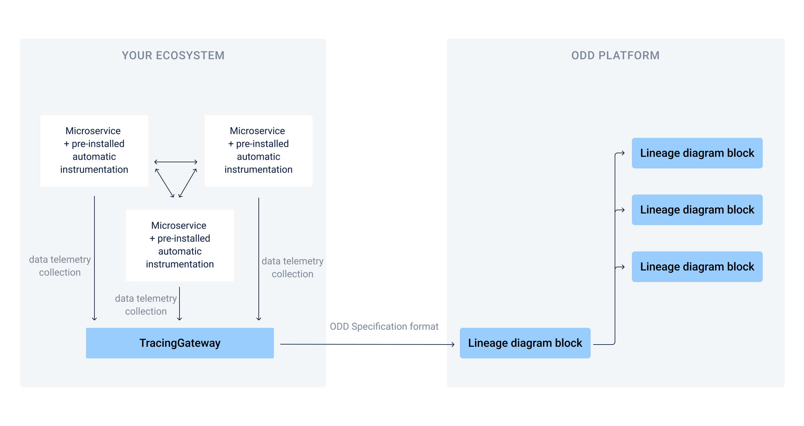
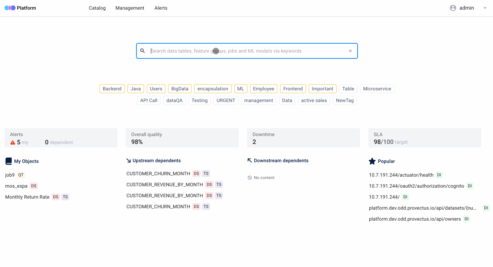

# Features
[Federation Data Catalog](#federation-data-catalog) \
[End-to-end Data Objects Lineage](#end-to-end-data-objects-lineage) \
[End-to-end Microservices Lineage](#end-to-end-microservices-lineage) \
[Metadata Storage](#metadata-storage) \
[Manual Object Tagging](#manual-object-tagging) \
[Data Quality Test Results Import](#data-quality-test-results-import) \
[ML Experiment Logging](#ml-experiment-logging) \
[Pipeline Monitoring and Alerting](#pipeline-monitoring-and-alerting) 
## Federation Data Catalog
> :heavy_exclamation_mark: Coming soon! The description below is for informational purposes only.

The Catalog is a tool which helps to bring distributed catalogs together in the Platform. \
\
**How it works.** You connect each catalog to the Platform &rarr; It pulls the data without postprocessing (statistics creation and data cleansing are not supported) to save in ODD servers &rarr; The data from each source automatically occurs in a Platform account. \
\
To collect data from decentralized sources ODD uses a pull strategy (read more about strategies [here](Architecture.md#push-and-pull-strategies)). \
To connect your data sources with the Platform use the [API](https://github.com/opendatadiscovery/odd-platform/tree/main/odd-platform-specification). 

## End-to-end Data Objects Lineage
The Platform supports a lineage diagram, so you can easily track movement and change of your data entities. \
ODD supports the following **data objects**: 
* Datasets
* Data providers (third-party integrations)
* ETL and ML training jobs
* ML model artifacts and BI dashboards

[Read more](https://github.com/opendatadiscovery/opendatadiscovery-specification/blob/main/specification/specification.md#data-model-specification) about how these entities are used in the **ODD Data Model**.

## End-to-end Microservices Lineage 
This feature helps trace data provenance of your microservice-based app. ODD represents microservices as objects and shows their lineage as a typical diagram. \
The picture below shows the process of metadata ingestion. 

## Metadata Storage 
The Storage is a data catalog which gathers metadata from your sources. Data processing is based on the near real-time approach.  A storage space is not limited. \
**ODD & PostgreSQL** provide saving metadata, lineage graphs and full text search, so extra integrations (Elasticsearch, Solr, Neo4j etc.) are not required.   
### Advanced search 
In your Platform account you may find any metadata element using the following options:
* Full-text search 
* Filtering by datasources, owners and tags 
## Manual Object Tagging 
Manage your metadata by tagging tables, datasets and quality tests. Tags provide easy filtering and searching.

### Tag both tables and each column
You may apply **tags** to metadata entities or use **labels** to mark elements of these entities. 
## Data Quality Test Results Import
Monitor test suite results in the Platform and at the same don't think about masking or removing sensitive data. Your datasets don't migrate to your ODD Platform installation, it gathers test results only. \
The Platform is compatible with **Pandas** and **Great expectations**.
## ML Experiment Logging 
The Platform helps track and compare your experiments. It enables you to:
* Explore a list of your experiment's entities (tables, datasets, jobs and models)
* Log the most successful experiments

## Pipeline monitoring and alerting 
Running your pipelines are easier with manageable parameters available in ODD. For example, you may track modifications of your dataset using a revision history option. Also the Platform represents metadata of your entities such as table structure, field type, description and versions.
### Alerting 
In the Platform you may find two types of alerts: 
* Notifications for cases when somthing goes wrong with entities you assigned to as an owner
* Notifications for upstream and downstream items

**Dataset alerts** and **job alerts** detect backward-incompatible changes of schemas and source targets.

<!---
| Object name | Description |
| --- | ----------- |
| **DataInput** | Title |
| **DataInput** | Title |
 
-->