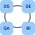

# Overview
[About ODD](#about-odd) \
[The platform for your business](#the-platform-for-your-business) \
[Features and use cases](#features-and-use-cases) \
[Start using ODD](#start-using-odd)
## About ODD
The open-source Data Discovery Platform improves productivity, collaboration, and governance of modern data products and teams: \
   ✔️ Free open-source and community-driven \
   ✔️ ML first citizen \
   ✔️ AI-based UX \
   ✔️ End-to-end microservices lineage support \
   ✔️ Flexible data quality integration options \
   ✔️ Auto-generated ML experiment lineage and metadata

## The platform for your business
 ODD's **target audience** includes large-scale 
companies challenging data mesh concept, small and mid-scale companies seeking 
OSS data catalogue solution and also
DS teams
aiming at better data governance. \
 \
 **An ecosystem for all data team members**. Platform functionality covers requirements of Data Scientists and Engineers as well as Data Analysts, Architects, QA and BI Engineers.\
\
 **Onboarding to data** helps newcomers get such important information as data structure, data owners and pipelines.

## Features and use cases 
Dive into ODD opportunities with a list of ODD features and use cases for different types of users.
## Start using ODD
[Get started](https://github.com/opendatadiscovery/odd-platform/blob/main/docker/README.md) right now or [schedule demo](https://calendly.com/germanosin/opendatadiscovery-demo?month=2022-01) for free. To get more info go to [opendatadiscovery.org](https://opendatadiscovery.org/)

<!---
> Open Data Discovery makes all your data entities reliable, observable, and easily discoverable.
-->
