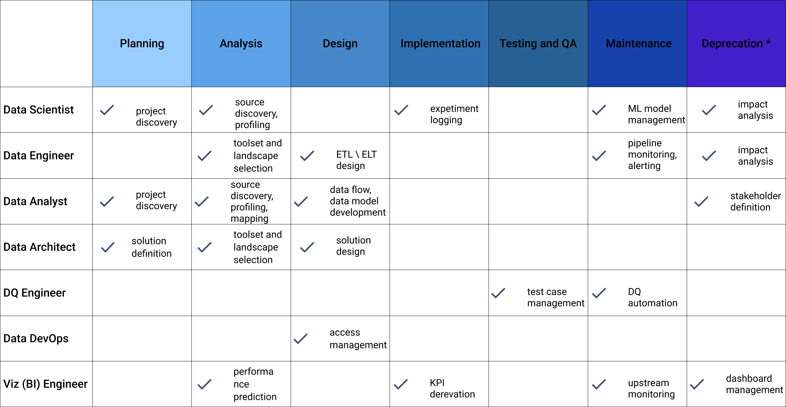

# Overview
## About ODD
The open-source Data Discovery Platform improves productivity, collaboration, and governance of modern data products and teams: 
* Free open-source and community-driven 
* ML first citizen
* End-to-end microservices lineage support 
* Flexible data quality integration options 
* Auto-generated ML experiment lineage and metadata 

To use Platform solutions more effectively apply [**ODD Specification**](https://github.com/opendatadiscovery/opendatadiscovery-specification/blob/main/specification/specification.md). It contains  best practices for managing your metadata. Its theoretical topics and examples help to build an effective data discovery process. Also the Spec covers data engagement and data federation problems.

### The platform for your business
 ODD's **target audience** is any data team regardless of its' size. It can be enterprises or large-scale 
companies challenging data mesh concept, small and mid-scale companies seeking 
OSS data catalogue solution and also
DS teams
aiming at better data governance. \
 \
 **An ecosystem for all data team members**. Platform functionality covers requirements of Data Scientists and Engineers, Product and Project Managers as well as Data Analysts, Architects, QA and BI Engineers.

### Solution matrix
ODD can benefit a team almost at every SDLC stage and for every team function:

## Pain points
### Onboarding to data
Every time a newcomer joins a data team, one faces a challenge of data management processes learning. Unfortunately, it may provoke overcommunication, reading irrelevant documentation and spending much time to pick out meaningful information.  \
ODD solutions help figure out data sources, find owners of this data, check DBs structures and get many other attributes that are necessary for working activities.  
### Data discovery
The more data a team has the more complicated connections occur between assets and components. ODD provides a search tool with AI-powered suggestion and flexible filters. Also the Platform supports a description option, so you can get detailed info about data entities.
### Data observability 
A problem of observability lack starts when irrelevant data appears in one's production cycle. To clarify when and where this data is and avoid delay use ODD's lineage diagram and flexible alert system.
## Features
Dive into ODD opportunities with a [list of ODD features](Features.md). 

## Use cases
[Here](Use_cases.md) you can find most popular use cases for different roles of your data team.

<!---
> Open Data Discovery makes all your data entities reliable, observable, and easily discoverable.
**Onboarding to data** helps newcomers get such important information as data structure, data owners and pipelines.
-->
