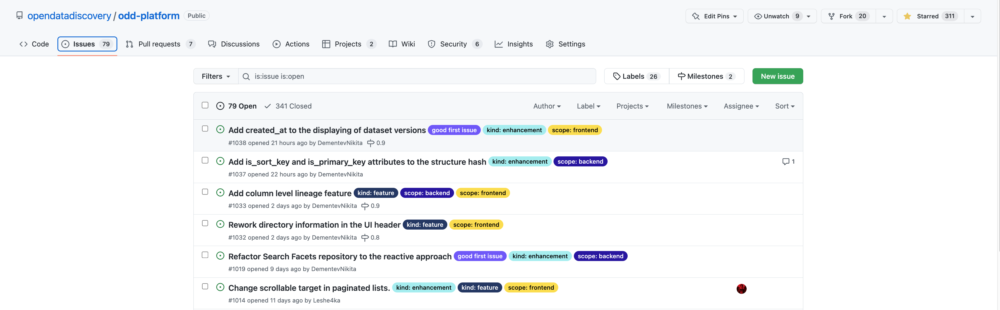

# How to contribute

We would be extremely grateful for any contribution whatsoever! We are happy to receive feature requests or bug reports as well as review Pull Requests from community. We believe that open-source is the way how we can make the best product together.

In this article you will find instructions on how to create an issue, open a PR or reach us via our Slack.\


## GitHub flow

OpenDataDiscovery GitHub organization has over 20 repositories including ODD Platform, ODD Collectors, utilities, etc. An overview can be found [here](github-organization-overview.md).

The whole process is similar across repositories, so here it's considered using the example of [ODD Platform](https://github.com/opendatadiscovery/odd-platform).

### Creating GitHub issues

Look for issues under \`Issues\` tab. If you'd like to report a bug or create a feature request, please file an issue.

<figure><figcaption><p>ODD Platform issues page</p></figcaption></figure>

You'd be prompted to select an issue type, whether this is a bug report or a feature request. Please fill issue's title and description with meaningful information and submit it. Our maintainers will be glad to pick it up, label and clarify the details with you.

### Forking a repository

Find and click a `Fork` button in GitHub and proceed with additional settings such as fork name, target account, etc

<figure><figcaption><p>Fork button in GitHub</p></figcaption></figure>

Clone the **forked** repository

```bash
git clone https://github.com/<username>/odd-platform.git
```

Create new remote repository that points to original repository to pull new changes from it

```shell
cd odd-platform/
git remote add upstream https://github.com/opendatadiscovery/odd-platform.git
git remote -v
```

Create a branch **in your fork**

```shell
git checkout -b issue/<issue_num>
```

That's it! You are good to go to make changes! Please take a look at [Build and Run](build-and-run/) page on how to set up your environment and run your code.
